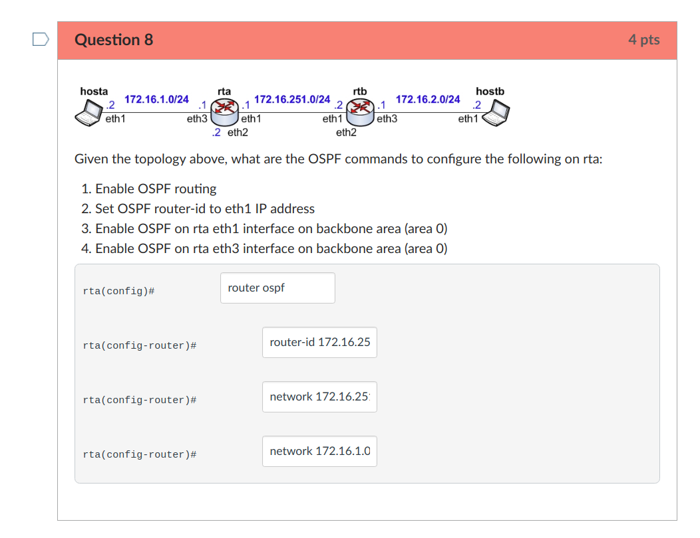

# KTHCanvasQuizFiller

### F**k KTH Canvas Quiz Redo

### How to
1. F12 Console
2. Copy&Paste&Run code from *getQuizAns.js* on submission page
3. Paste outpute to *fillQuizAns.js* and Copy&Paste&Run on redo page

All text input fields should be autofilled.
And headers of questions you answered wrong will be hightlighted.

### NB
1. If you get **errors** running the script, try to enable ES6 features.
  Open ***chrome://flags/#enable-javascript-harmony*** in chrome and enable harmony.
2. Only text input supported, others to be added. Don't forget to answer other questions!
